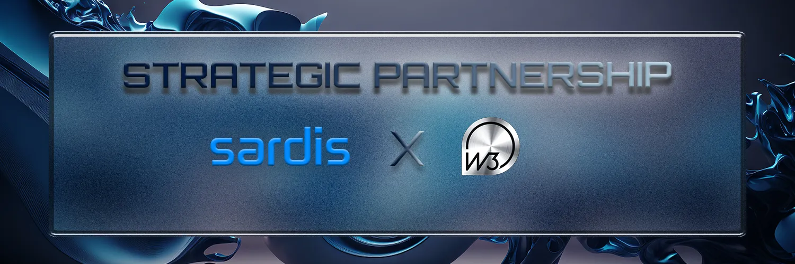

Sardis is a carefully crafted Layer 1 blockchain ecosystem actively running Bridge, Swap/Dex, and Stake, 2 mainnets, and 1 testnet feature. What makes us different from competitor blockchains: The Sardis Ecosystem is the digital disruption for traditional financial services. Sardis blockchain network has the power to revolutionize payment solutions and current blockchain technology with its most efficient features such as partly decentralization, transparency, scalability, security, stability with stablecoins, and low-cost, high-speed horizontal scaling.

On the other hand, Layer 2 projects are those that build on top of existing Layer 1 blockchains to provide better scalability and faster transactions without compromising security.

When POW and POS consensus systems are used in tandem with an hPOS consensus like the Sardis’, the disadvantages of those systems are reversed to being advantages. One minor downside to all this is the fact that hash power is still used by the miners generating the blocks, but since block generation does not require too much computational power, as opposed to transaction confirmation, the said disadvantage is negligible.

With the innovative Sardis V+ validation pool we make sure that all of our validators get paid amply for their services. They will take part in an extra staking pool where in accordance with the proportion of their stake in the PoS system they will receive monthly yields.

Layer 2 projects can be used to build applications that provide new features and capabilities. These projects are typically less expensive and require fewer resources than Layer 1 blockchains, which makes them attractive to developers and businesses.

The benefits of being a Layer 2 project in the Sardis Ecosystem include:

• Lower cost of development and operations

• Faster transactions and improved scalability

• Ability to add new features that are not available on Sardis

• Ability to experiment with new features and technologies without major risk

## About Web 3 Technologies Association ( Web3 Teknolojileri Derneği)

The purpose of the establishment of the Web3 Association is to carry out educational activities in order to create qualified manpower in Turkiye.
Blockchain communities often focus on technical solutions. Web3 Technologies Association, on the other hand, believes that it can solve social problems by using this technology and focuses on this.
The rise of decentralized web 3 networks has created a whole new world of opportunities for developers. This new technology can enable developers to create applications that are more secure, efficient, and reliable than ever before.

With the help of hackathons, Mr. Ayan is helping to bring this technology to the forefront.

>The founder of Web 3 Technologies Association — Bugra Ayan says: “Before founding the association, I published 3 books on a blockchain. We interviewed Web3 players from around the world for about a year, including the Web3 foundation in Switzerland,” Ayan continues. On the other hand, he states that they have already established a free education network with more than ten thousand members before establishing the association.

A hackathon is a competition where teams of developers come together to create innovative software solutions in a short period of time. Hackathons are a great way for developers to challenge themselves and push the boundaries of technology.

Web 3 Technologies Association is organizing hackathons to encourage web 3 developers to work together to create new applications and technologies.

This is a great way to get developers up to speed on the latest technologies and tools. By providing free education, the Web 3 Association is showing Its commitment to the growth of the decentralized web.

## The partnership between Sardis and WEB 3 Technologies Association

The Web 3 association is composed of many blockchain developers, and they have recently become a partner of the Sardis Layer 1 blockchain. This will provide an opportunity for the developers to create new projects that will be launched on the Sardis blockchain.

The members of the Web 3 association will be able to create projects of their own, and they will be able to submit them to the Sardis Layer 1 blockchain. The best projects will be chosen, and the developers will be rewarded with grants from the blockchain. This will give them the incentive to create the best possible projects, and it will also help to increase the adoption of blockchain technology.

The grants will be used to fund the development of the projects, and they will also be used to help promote the projects. This will allow the developers to get their projects out to the public, and it will also help to spread awareness about the advantages of using the Sardis Ecosystem and blockchain technology Itself.

Overall, this is an exciting development for the Web 3 association and Sardis.

:::note
Social media links:
Linktree of Sardis Ecosystem:

https://linktr.ee/sardisblockchain

Links to Web 3 Association:

https://www.web3dernegi.com/

https://web3ogren.com/
:::