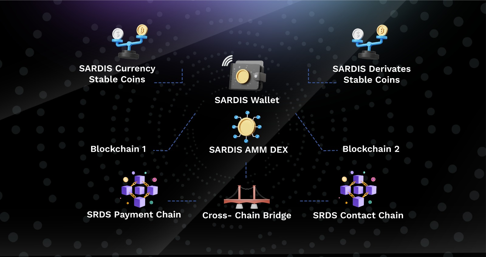

# Introduction to Sardis Network

Sardis Network (Sardis) is a high-efficiency and energy-saving multichain crypto ecosystem aiming to bring new areas of operation to the crypto landscape. Our network is compatible with smart contracts and supports high- performance transactions. The endogenous coins of Sardis are SRDX and SRDS. SRDX coin is pegged to the US dollar in value and is only used internally within the network, while SRDS is a floating value. Users are expected to earn SRDX (through dPOS staking, stakedex staking or DEX operations) and convert their earning to SRDS for when they want to monetize. 

## Sardis's Performance
- TPS: 20000+
- Average block interval: 3s
- Transaction time: Less then 3s

## Consensus Mechanism
hPOS consensus mechanism: it has the characteristics of low transaction cost, low transaction delay, and high transaction concurrency.

The maximum number of active validators supported is 21. 

## Economic Model 
The endogenous token on the chain is SRDX; the transactions consume SRDX as gas fee.

Miners pledge SRDX to become validator nodes. The reward of nodes is gas fee, which is distributed according to the mortgage proportion. 

Miners are also eligible to join the +V validator pool. Details of +V will be shared in the near future.

## Cross-Chain
Assets such as BNB, ETH and stable coins can be mapped to Sardis by an asset bridge. The realization method is to lock a certain amount of tokens on the original chain then generate a corresponding number of tokens on Sardis. The prices are drawn realtime and values calculated on-the-fly.

## Meta Transaction Function
The meta-transaction function is supported, which allows users to reduce gas fees step-wise, and Sardis will cover the payment of the reduced part. The meta-transaction function allows to minimize the migration cost of DApp developers, as well as to effectively reduce the cost of DApp users.

## Sardis Technical Characteristics
- A KYC required network to maintain the security of the network and assets.
- Support the programmability of EVM, the compatibility of smart contracts to reduce development or migration costs.
- Meta-transaction function: gas fee reduction, effectively reducing the cost of developers and users on the chain.
- Support cross-chain asset transfer to optimize users’ experience.

  
## Support Plan of Sardis
### Financial Support
- Sardis will set up a special fund to invest, support and incentivize high-potential developers.
- Sardis will launch a variety of developer activities and competitions to discover and fund potential developers. 
- In order to reduce the cost of users on Sardis dApp, the Sardis meta transaction function will reduce the gas fee of users holding SRDX in a step-wise manner.

### Participate in Test Environment of Sardis
Official Website
www.mysardis.com

Public Testnet
chainid 11612

PRC
wss://ws-testnet.sardisnetwork.com 
https://testnet-rpc.sardisnetwork.com/

Blockchain Explorer
https://testnet.sardisnetwork.com/

Test Coin Faucet
https://faucet.sardisnetwork.com/

Technical Support Email
contact@mysardis.com

## Interact with Us on Social Media and Other Platforms

 Twitter: https://twitter.com/mysardis 
 Telegram Channel: https://t.me/sardisblockchain 
 Medium: https://medium.com/@mysardis 
 GitHub: https://github.com/sardisnetwork/ 
 SardisExplorers: https://contract-mainnet.sardisnetwork.com/ 
 SardisExplorers: https://payment-mainnet.sardisnetwork.com/ 
 SardisExplorers: https://testnet.sardisnetwork.com/ 
 Documentation: https://mysardis.com/archive-documents/ 
 Website: https://mysardis.com

## Risk Warning
- All users and developers can participate in the current test environment and subsequent stages of Sardis for free, and there is no charging scenario.
- All users must distinguish the test environment from the Mainnet. The assets generated in the test environment have no value. Be aware of counterfeit currency fraud.
- Sardis announces authorization, promotion and other collaborations only through the official social media platform. Developers and users should check carefully to avoid losses.
- Do not misread the official website, and be cautious with private key phishing.
