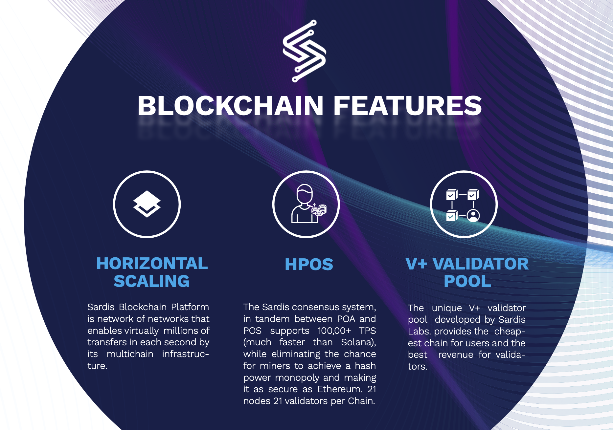

# FAQ (Frequently Asked Questions)

## What is hPOS?

Sardis hPOS Consensus

With Sardis’ hybrid proof of stake consensus, a limited number of base hash power miners generate the blocks for transactions to be written on. These base nodes are owned and operated by Sardis. Randomly selected groups of PoS validators then validate the transactions on the mined blocks and write them onto the blockchain. The selected POS validators also do checkpoints, which is a mechanism that improves the security of a blockchain by making the blocks behind the checkpoints irreversible regardless of any reorgs, permanently preventing blocks older than a specific set value from being reorganized, thus rendering the blockchain much more difficult to tamper with and considerably more secure.

One of the advantages of Sardis hPOS is that it mostly eliminates the chance for miners to achieve a hash-power monopoly, rendering the infamous 51% attack near impossible. This is because POS validators validate the newly mined blocks and vote on any changes to the network’s consensus roles, and the consensus they provide is derived from their staking and not their hash powers. Another advantage of Sardis hPOS consensus is, compared to pure POS blockchains, that the Sardis’ consensus is less vulnerable to long-range attacks, the counterpart to 51% attacks on pure POS consensus systems because their block production is still gated by the Sardis-owned computational power of the bootstrap nodes, which is used in pure POW systems.

Thus hPOS consensus systems regulate and negate the disadvantages of POW and POS systems, while taking advantage of the strengths of the said systems, enabling an embedded balancing of the two opposing systems for better security and price stability. When POW and POS consensus systems are used in tandem with an hPOS consensus like the Sardis’, the disadvantages of those systems are reversed to being advantages. One minor downside to all this is the fact that hash power is still used by the miners generating the blocks, but since block generation does not require too much computational power, as opposed to transaction confirmation, the said disadvantage is negligible.

